<!-- Hey now, are you reading my source code? -->
<style>
.forceBreak { -webkit-column-break-after: always; break-after: column; }
</style>

```{r setup, include=FALSE}
library(knitr)
opts_chunk$set(echo = FALSE)
```

## The relevant xkcd comic    

<div class="columns-2">


"_If that doesn't fix it, git.txt contains the phone number of a friend of mine who understands git. Just wait through a few minutes of 'It's really pretty simple, just think of branches as...' and eventually you'll learn the commands that will fix everything._"

</div>

## Quick note on jargon

Technobabble is the name of the game here, but here's a rough guide to interpret Git-speak:

> - Git : "The free computer program you're about to learn about"
> - GitHub : "A website (remote) where you can store repositories"
> - Repo : "short for repository, a folder that is tracked with version control"
> - Remote : "A server that backs up your repo"
> - Commit : "Read: recording the present project state"
> - Branch : "Read: an alternate version of your project"

## Agenda  

0. What is version control?
1. Using Git locally (a crash-course in Git)
2. Using Git with all your friends (remotes and how to talk to them)

# Part 0. What is version control | and what is "Git"

## Version control in the wild 

```{r version-pic, out.width = "600px"}
# TODO: New picture
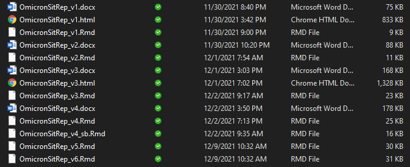
```

_Is this version control?_

_Is this **good** version control?_  

## Motivating problems  

__Why is the standard approach _often_ insufficient?__

- Lack of standards leave collaborators confused  
- When things go bad, they get _really_ bad  
- Project state is ambiguous, not always linear

```{r this_is_fine, out.width = "550px"}
include_graphics("../img/fine.png")
```

## So what is Git?

"[git] is a stupid (but extremely fast) directory content manager.  It
doesn't do a whole lot, but what it _does_ do is track directory
contents efficiently." - Linus Torvalds  

- Linus Torvalds in 2005

<div class="columns-2">
```{r git-lord-1, out.width="250px"}
include_graphics("../img/linus.jpg")
```

<p class="forceBreak"></p>

```{r git-logo, out.width="250px"}
include_graphics("../img/dvc.png")
```
</div>

<div class="notes">
Read Torvalds own description of it here: https://github.com/git/git/blob/e83c5163316f89bfbde7d9ab23ca2e25604af290/README
</div>

## Okay, but what _is_ it  

Git is a tool for tracking the state of your project

- Maintain a detailed revision history of the files you want    
- Create and jump between many different saved versions 
- Incorporate changes in a predictable (and reversible) way 

<div class="centered">

```{r snapshot, out.width = "350px"}

```

</div>

# How to Git it  

## Gitting Set Up | Git for Windows  

- __Required regardless of what interface you use__
- Mostly command line-based, also ships with lightweight GUI
- _Interface can be daunting to the casual user_  

<div class="columns-2">

```{r git-native-1, out.width = "300px"}
include_graphics("../img/git_cli.png")
```
<p class="forceBreak"></p>
```{r git-native-2, out.width = "300px"}
include_graphics("../img/git_for_win.png")
```
</div>

## Gitting set up | Github Desktop

- Serves as a "point-and-click" interface for Git operations
- Easily manage a large number of repositories from one app  
- _I will be using Github Desktop to demonstrate a GUI interface_  

<div class="columns-2">

```{r gh_desktop, out.width = "500px"}
include_graphics("https://cloud.githubusercontent.com/assets/359239/26094502/a1f56d02-3a5d-11e7-8799-23c7ba5e5106.png")
```

```{r gh, out.width = "300px"}
include_graphics("../img/github.jpg")
```
</div>

# Part 1. Using Git Locally | Let's git going  

## Local Git Commands  

Primary objectives:  

- Start a new repository
- Create and add files to it
- Checkout previous revisions / other branches

```{r file-stages-1, out.width = "500px"}
include_graphics("https://git-scm.com/book/en/v2/images/lifecycle.png")
```

## Local Git commands 

_(We will not be using command line here)_

We'll 

```{r hackerman, out.width = "300px"}
include_graphics("../img/hackerman.png")
```

## Creating a new repository | git init

- Ideally you would create a repository at the start, but you can do so at any time  
- You don't (and probably shouldn't) track every file 

<div class="columns-2">

```{r init, out.width = "400px"}
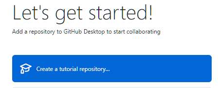
```

<p class="forceBreak"></p>

```{r init2, out.width = "250px"}
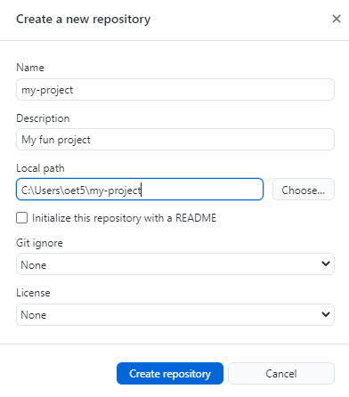
```


</div>

## View file status | git status/add

<div class="columns-2">
All unsaved changes to your repository will show up here  

- Add changes to commit to history
- Deselect any changes to ignore

<p class="forceBreak"></p>

```{r file-stages, out.width = "450px"}
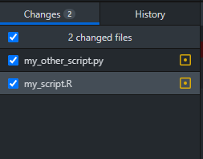
```

</div>

## Recording your changes | git commit

Label your changes!

<div class="columns-2">

- Make a succinct but useful title
- Provide more details on what changes were made

<p class="forceBreak"></p>

```{r commit, out.width = "500px"}
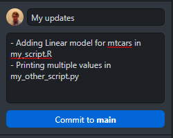
```

</div>

## Be mindful of what you commit!  

```{r deploy_key, out.width = "800px"}
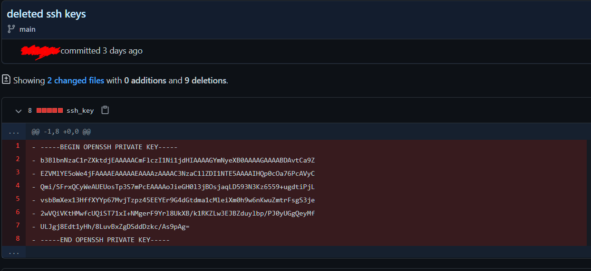
```

## Be mindful of what you commit!  

With very few exceptions, everything tracked within Git can be recovered.  

- In a "parallel universe", you never deleted that data file  
- Begin thinking about this *before* you add files  
- Be especially careful of PII, passwords, private keys, etc.

## "ignoring" files | Or: practicing mindfulness  

With a `.gitignore` file in your repo, you can specify explicitly what files or folders you want to remain un-tracked.  

- This is simply a plaintext file in your root folder
- [Templates](https://github.com/github/gitignore) are available online for many languages and project types

```{r ignore, out.width = "500px"}
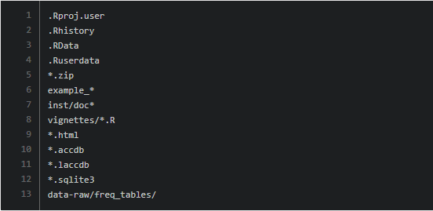
```

# Seeing it in action

## Demonstration  

Let's see how all of these commands work for a simple task:  

- Initialize a new repository in GitHub Desktop 
- Create and commit a simple script   
- Create an commit a `.gitignore` file  
- Remove an unwanted file from the repository  

<div class="notes">
Here we will create a new repository
</div>

## Enter: Branching

Changes aren't always linear!

A branch allows you to work on changes to your project while keeping the "working" state intact.  

- A branch inherits its history from its parent
- Easily merge back in changes you made in the branch (even if the parent continues to develop independently)  

<div class="centering">

```{r branching, out.width = "475px"}
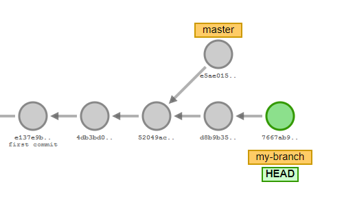
```

</div>

## Creating/switching branches | git branch

`git branch` creates a new branch off of the current one

- If you're just starting out, the current branch is likely *master* or *main*    
- [Visualize](http://git-school.github.io/visualizing-git/) it yourself

```{r branches, out.width = "400px"}
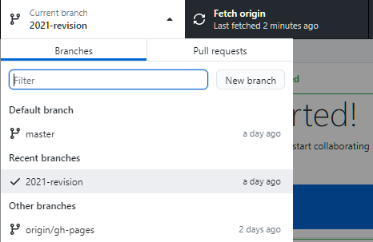
```

## Merging branches | git merge  

`git merge` is used to merge a distant branch into the current one.

- Merging does not automatically delete the branch being merged in  
    - The history of the distant branch is also added to the current branch  
- Most of the merges locally will be "fast-forward" merges

# Let's take a look

## Working with branches  

Looking back at the same repo we created earlier, let's try out these new commands:  

- Create a new branch and check it out
- Make changes in our new branch and merge them into master  
- Checkout a past commit  

## Where merges git dicey  

If you (or your team) develops on more than one branch concurrently, you may run into merge conflicts.  

- If the same line is edited across branches, Git will not know what one takes precedence in a merge
- Several merge [strategies](https://git-scm.com/docs/git-merge#_merge_strategies) exist to automate this  
- For small merges it's often easier to workup manually  

```{r conflit, out.width = "500px"}
include_graphics("../img/conflict.png")
```

## Fixing a merge conflict

Git will provide indicators in any files containing merge conflicts indicating what lines deviate  

```
<<<<<<< <current_branch>
I'm not a cat
=======
I'm not a lawyer
>>>>>>> <branch_being_merged>
```

- Fix the document as you want it to appear and stage the changes
- Sometimes it's not an A/B problem and will require revision  

Let's demonstrate...  

# Part 2. Using Git with all your friends  

# Almost there!

## Starting a new project on GitHub

When using GitHub, you can start your repository directly from the website  

- You can also create a blank repository and push a repo you've already created locally  
- Projects can be housed under either a user, group, or CDC namespace  
- Optionally set visibility

__Let's take a look...__  

## GitHub Namespaces

You have two main options here, depending on your project requirements:

- CDCGov: Public-facing, externally visible
- CDCEnt: Private projects, no external access

## Interacting with remotes

Now that we have a _remote_ repository set up, we need to introduce just three more git commands to interact with that repository:

- git clone  
- git pull
- git push

<div class="notes">

If you're reading this it's because you saw that I'm skipping fetch and died a little inside.

I think fundamentally fetch is the safer and better option for most projects, but for small scale projects most will likely not notice the difference (especially if they're working alone).

Those that do notice will discover the difference eventually, and it avoids having to teach it here in such a short time slot.

For the astute among you who read this:

git fetch pulls refs and objects from the remote, but does not merge them in.
git pull performs a fetch and then attempts to merge them

</div>

## Recall our Dataflow

```{r git-transport, out.width = "500px"}
include_graphics("../img/git-transport.png")
```

credit [Oliver Steele](https://blog.osteele.com/2008/05/my-git-workflow/)

## Cloning an existing repository | git clone  

`git clone` creates a local copy of a remote repository  

- You Only Clone Once (YOCO)
- By default, the directory will be named after the title of the repository  
- **It is not possible to "clone" bits and pieces of a larger repository**   

```{r clones, out.width = "450px"}

```

## Gitting changes from remote | git pull  

`git pull` returns any updates from a remote repository and merges them locally  

- Notice that I said it merges those changes (be wary)  
- `fetch` is safer because it does not attempt to merge automatically  
- When in doubt, just look at the changes online  

## Pushing your changes | git push  

Finally, we send our updates to the remote repository using `git push`

- Double check that everything is in order _before_ you push  
- It's best practice to always `pull` before `commit` and `push`

```{r push, out.width = "450px"}
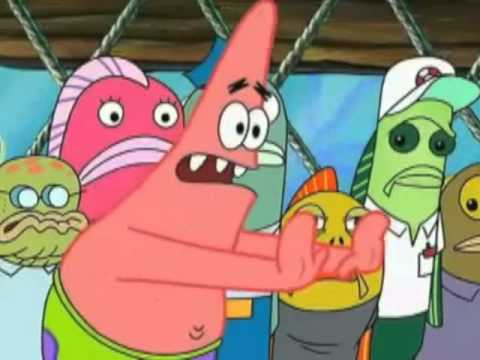
```

# Demonstration

# Takeaways

## Takeaways

There are many workable models for how best to use these commands

```{r, out.width = "500px"}
include_graphics("https://i2.wp.com/lanziani.com/slides/gitflow/images/gitflow_1.png")
```

## Takeaways

My advice:  

<div class="columns-2">

- Commit often, grouping changes logically  
- Branch earlier rather than later  
- Make your commit messages *descriptive*

<p class="forceBreak"></p>

```{r messages, out.width = "250px"}
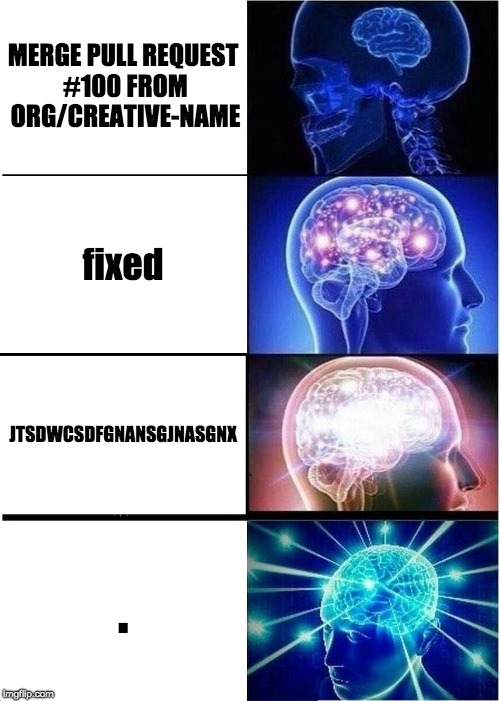
```

</div>

## There's a lot more here to talk about  

Stashing, blaming, diffing, cherry-picking, rebasing

We will stop here for the sake of time and to avoid overload

```{r stop, out.width = "500px"}

```

## Getting help

I hope you'll continue to explore!

- These slides (and the Rmd source) are available on [GitHub](https://github.com/beansrowning/git-talk)  
- Ready for a deeper dive? Check out the [book](https://git-scm.com/book/en/v2)
- Working on the command line? Try this Katakoda course.

```{r help, out.width = "500px"}

```

# Thanks!