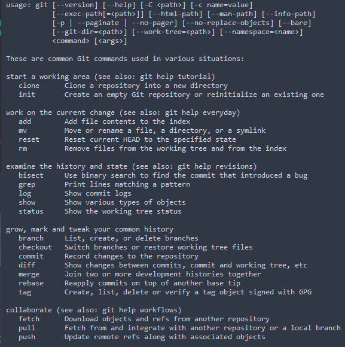
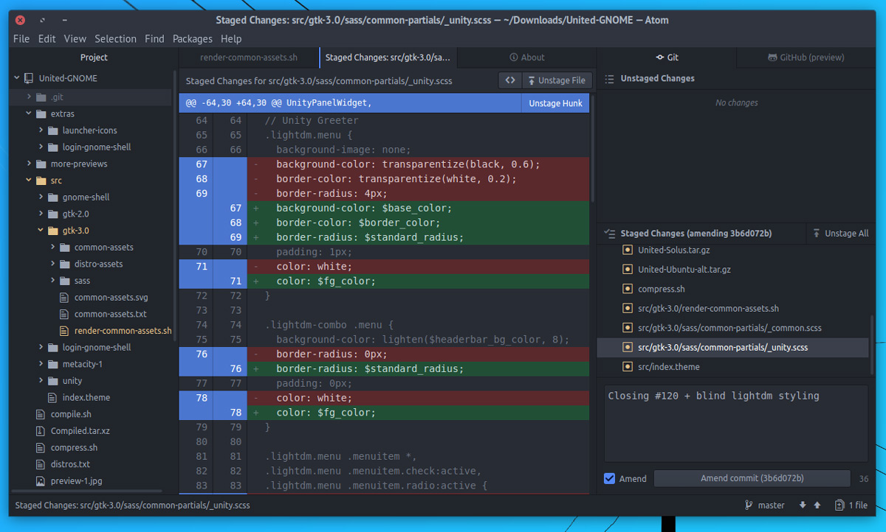

<!-- Hey now, are you reading my source code? -->

```{r setup, include=FALSE}
library(knitr)
opts_chunk$set(echo = FALSE)
```

## Relevant xkcd  

<div class="columns-2">


"_If that doesn't fix it, git.txt contains the phone number of a friend of mine who understands git. Just wait through a few minutes of 'It's really pretty simple, just think of branches as...' and eventually you'll learn the commands that will fix everything._"

</div>

# Preface  


## A bit about this talk  

- Targeting newcomers and git-exiles alike
- Presented with a GUI, but framed with the underlying commands   
- This is a work in progress (any suggestions)?
- Feel free to contribute!

## Things we might gloss over a bit

The scope of Git far exceeds this short talk

- How to exit Vim
- Specific CLI arguments  
- Cherry-picking, rebasing
- submodules, CI/CD, etc.

## Why should we care?

*Axiom:* Proficiency in collaborative tools breeds collaboration

- Collaborative science is better [science](https://github.com/buildingthefuture)  
- All of your friends are already doing it  
- One more tool in the toolbox

## A bit about me

- RUG Vice Chair
- Native Texan
- MSc. Epidemiology from London School of Hygiene and Tropical Medicine
- No formal computer science or IT training  
    - Learned Python, R, and C mostly online

```{r my-photo, out.width = "275px"}
include_graphics("../img/about_me.jpg")
```

## Agenda  

0. What is version control?
1. A peek at where we're headed  
2. Using Git locally (a crash-course in Git)
3. Using Git with all your friends (remotes, Gitlab, and GitHub)


# Part 0. What is version control | and what is "Git"

## How many of you know the pain?  

```{r version-pic, out.width = "500px"}

```

_Is this version control?_

_Is this **good** version control?_  

## Motivating problems  

__Why is "track changes" _often_ insufficient?__

- No "master" record
- "diffing" quickly becomes unwieldy for both user and software
- Merging different "branches" often produces unwanted and non-deterministic side-effects  

```{r this_is_fine, out.width = "550px"}
include_graphics("../img/fine.png")
```

## Motivating problems  

__Why is "track changes" _often_ insufficient? (continued)__

- Only the state of a single file is maintained  
- Concurrent editing not _impossible_, but not straightforward either  
    - SharePoint, et al. solve this only to a point

## So what is Git?

- Git is a distributed version control system (VCS)
- Conceived by Linus Torvalds in 2005 (the "Linux guy")
- Maintained by Junio Hamano thereafter (the "gitster")

<div class="columns-2">
```{r git-lord-1, out.width="200px"}
include_graphics("../img/linus.jpg")

```

```{r git-logo, out.width="250px"}
include_graphics("../img/dvc.png")
```
</div>

<div class="notes">
Read Torvalds own description of it here: https://github.com/git/git/blob/e83c5163316f89bfbde7d9ab23ca2e25604af290/README
</div>

## Okay, but what _is_ it  

Git is a tool for tracking the state of your project

- Maintain a detailed revision history
- Revert all files to any prior state  
- Create separate branches without affecting the "master" branch
- Merge branches in a sensible and predictable way

<div class="centered">

```{r snapshot, out.width = "400px"}
include_graphics("../img/snapshot.jpg")
```

</div>

## Why Git?

One of the main reasons for Git's success is due to the original task being almost the worst case scenario:

<div class="columns-2">

- 15 million+ lines of code to track
- 10,000+ contributors
- Had to be fast, lightweight
- Had to work across time zones, locales


```{r linux, out.width = "180px"}
include_graphics("../img/linux.png")
```
</div>


# How to Git it  

## Git clients currently allowed by ITSO | Git for Windows  

- __Required regardless of what interface you use__
- Command line daunting for the casual user
- Default commit message editor is Vim (which is _really_ daunting to the casual user)

```{r git-native, out.width = "300px"}

include_graphics("../img/git_for_win.png")
```

## Git clients currently allowed by ITSO | RStudio  

- Self-contained, works well with project framework
- Somewhat limited with regards to more advanced operations  


<div class="columns-2">

```{r rstudio, out.width = "350px"}


```

</div>

## Git clients currently allowed by ITSO | GitKraken & Sourcetree

- Both have detailed graphical interfaces for all git operations  
- Easily manage a large number of repositories from one app  
- _I will be using GitKraken to demonstrate a GUI interface_  

<div class="centering">

```{r kraken, out.width = "500px"}

```  

</div>

## Honorable mentions

<div class="columns-2">

- Atom (created by GitHub)

```{r atom, out.width = "350px"}

```

- Visual Studio Code

```{r vscode, out.width = "350px"}
include_graphics("../img/vscode.png")
```  

</div>

# Part 1. Project workflows

## We've only seen the tip of the iceberg so far  

```{r beyond, out.width = "500px"}

```


## Visual Diffing and blaming  

Easily view when changes were made and by whom  

- Start discussions on a particular commit or line of code  
- See exactly which commits produced what changes  
- Realize how often you yourself the source of the issue

```{r blame, out.width = "500px"}

```

## Issue tracking  

GitLab and GitHub offer a fully featured issue and project tracking system that integrates directly with Git.  

- Create issues and track discussion on GitLab  
- Reference issues or people in your commit messages
    - Automatically close issues or ping people when you push a commit
- Estimate and track time spent

```{r issue-tracking, out.width = "500px"}

```

## Merge requests (Pull Requests)

For complicated and involved merges, discuss and collaborate with partners before you merge  

- All commits to the branch being merged aggregate on a single page  
- Show a summary of all files that will be affected  
- History and discussion retained after the merge is completed  


## Snippets (Gists)

Quickly create one-off scripts and hacks you can share and continue to edit  

- Declutter your directories full of small R scripts  
- Keep your secrets private, or share broadly  
- Create how-tos (some of you may have used [mine](https://git.biotech.cdc.gov/snippets/58))

## ..and many, many more

## Where are all of my friends?

There are both internal and external options for hosting repositories

- GitLab (at least 2 internally, external as well)
- GitHub (externally facing)
- Bitbucket (external, owned by Atlassian)

```{r providers, out.width = "200px"}

include_graphics("../img/github.jpg")
include_graphics("../img/bitbucket.jpg")
```

## GitLab inside the CDC  

Two Options (probably others):  

- [git.cdc.gov](http://git.cdc.gov)
- [git.biotech.cdc.gov](http://git.biotech.cdc.gov)

_I'm partial to the latter because all my stuff is there already_

```{r gitlab-logo, out.width = "200x"}

```

## Gitting access to CDC Gitlab

You can do so now just by using your windows credentials using the LDAP tab!

```{r cdc_gitlab, out.width = "600px"}

```

## Gitting access to SciComp Gitlab

Access to git.biotech.cdc.gov also uses your windows credentials, but you must request access   

- email support@mail.biotech.cdc.gov and ask for an account
- Site is almost the exact same (though more NCEZID projects are likely housed here)  

<div class="notes">
Here we will go on and show to make a new repository from GitLab from scratch
</div>

## Options for using external sites  

CDC has an organization on GitHub where you can post projects externally  

- If you're curious, see guidance [here](http://it-guides.cdc.gov/source-code/howtoOpenSource/)  
- Also a cool global GitHub for Government group  
- Many similarities to GitLab  

```{r cdc_hub, out.width = "650px"}

```

# Part 2. Local Git commands

## Local Git commands  

Primary objectives:  

- Create and add files to a local repository  
- Create and merge branches
- Checkout previous revisions / other branches

Don't focus on the command names themselves, but the actions they perform  

_(We will not be using command line)_

```{r hackerman, out.width = "200px"}
include_graphics("../img/hackerman.png")
```

## Begin a repository | git init

- `git init` creates an empty repository to begin tracking your files  
- Ideally you would create a repository at the start, but you can do so at any time  
- Not every file present in your project folder has to be tracked in the repo  

```{r init, out.width = "500px"}

```

## View file status | git status

`git status` displays the current state of files in your project

<div class="columns-2">
With Git there are four "states" that your files can reside in:  

- Untracked  
- Unmodified  
- Modified
- Staged  

```{r file-stages, out.width = "375px"}
include_graphics("../img/file_status.png")
```

</div>

## Tracking your files | git add

To begin tracking a file, we use the `git add` command.

- Files added are "staged", but not yet committed
- Also use this command to stage changes of modified files

```{r git-add, out.width = "350px"}

include_graphics("../img/add_after.png")
```  

## Recording your changes | git commit

`git commit` creates a record of all tracked files.  

Three core parts:

- Commit message (_"Made implicitly missing data explicit"_)
- Commit author (me)  
- SHA1 hash (unique to every commit, used to reference)

```{r commit, out.width = "500px"}

```

## Removing a file from the repo | git rm

`git rm` removes a file both from disk and from the repo

- Base operation the same as deleting file and then staging the changes  
- Removes the files from the current index (and all future commits)

## Be mindful of what you track  

While tracked files can be "deleted" at a later time, any commits made before the file was deleted remain accessible.

- Begin thinking about this *before* you make a commit
- Be especially careful of PII, passwords, private keys, etc.
- When in doubt, assume your data is visible by all
- Consider summarizing data if it *should* be tracked

## How to "ignore" files

With a `.gitignore` file in your repo, you can specify explicitly what files you want to remain untracked.  

- This is simply a file in your root folder
- [Templates](https://github.com/github/gitignore) are available online for many languages and project types

```{r ignore, out.width = "500px"}

```

# Seeing it in action  

## Demonstration  

Let's see how all of these commands work for a simple task:  

- Initialize a new repository in GitKraken  
- Create and commit a simple script from RStudio  
- Create an commit a `.gitignore` file  
- Remove an unwanted file from the repository  

<div class="notes">
Here we will create a new repository
</div>


## Let's git branching  

A branch allows you to diverge from the main track while keeping the state of the main track intact.  

- A branch inherits its history from whichever branch it was forked off of  
- Easily merge back in changes you made in the branch (even if the main branch continues to develop independently)
- One of the most powerful features of Git  

<div class="centering">

```{r branching, out.width = "475px"}

```

</div>

## Creating a branch | git branch

`git branch` creates a new branch off of the current one

<div class="columns-2">

- If you're just starting out, the current branch is likely *master*  
- See a list of all available branches with `git branch -a`
- [Visualize](http://git-school.github.io/visualizing-git/) it yourself

```{r branches, out.width = "200px"}
include_graphics("../img/branches.png")
```
</div>

## Switching branches | git checkout  

`git checkout` is used to switch between branches and a few more things:  

- The same function is used to "checkout" a previous commit  
- Checking out a previous commit will detach your "HEAD"  
- Also used to "un-stage" a file (ie. staged -> modified)
    - `git checkout -- <file>`

## Merging branches | git merge  

`git merge` is used to merge a distant branch into the current one.

- GitKraken provides a drag-and-drop mechanism for merging  
- Merging does not delete the branch being merged in  
    - The history of the distant branch is also added to the current branch  
- Most of the merges locally will be "fast-forward" merges

# Let's take a look

## Working with branches  

Looking back at the same repo we created earlier, let's try out these new commands:  

- Create a new branch and check it out
- Make changes in our new branch and merge them into master  
- Checkout a past commit  

<div class="notes">
If you're following along with no git installation, you might try the GitHub  
visualization tool to test these concepts: http://git-school.github.io/visualizing-git/  
</div>

## Where merges git dicey  

If you (or your team) develops on more than one branch concurrently, you may run into merge conflicts.  

- If the same line is edited differently across branches, Git will not know what one takes precedence   
- Several merge [strategies](https://git-scm.com/docs/git-merge) exist to automate this  
- For small merges it's often easier to workup manually  

```{r conflit, out.width = "500px"}
include_graphics("../img/conflict.png")
```

## Fixing a merge conflict

Git will provide indicators in any files containing merge conflicts indicating what lines deviate  

```
<<<<<<< <current_branch>
... (lines from your branch)
=======
... (lines from branch being merged in)
>>>>>>> <branch_being_merged>
```

- Correct the document as you want it to appear and stage the changes to fix the conflict  

Let's demonstrate...  

## Takeaways

There are many workable models for how best to use these commands

My advice:  

<div class="columns-2">

- Commit often, grouping changes logically  
- Branch earlier rather than later  
- Make your commit messages *descriptive*

```{r messages, out.width = "150px"}

```

</div>

# Part 3. Using Git with all your friends  


# Almost there!

## Starting a new project on GitLab

When using GitLab or GitHub, you can start your repository directly from the website  

- You can also create a blank repository and push a repo you've already created locally  
- Projects can be housed under either a user or group namespace (like RUG or NST)
- Optionally set visibility (just _how_ collaborative do you want to be?)

__Let's take a look...__  

## Interacting with remotes

Now that we have a _remote_ repository set up, we need to introduce just three more git commands to interact with that repository:

- git clone  
- git pull
- git push

<div class="notes">

If you're reading this it's because you saw that I'm skipping fetch and died a little inside.

I think fundamentally fetch is the safer and better option for most projects, but for small scale projects most will likely not notice the difference (especially if they're working alone).

Those that do notice will discover the difference eventually, and it avoids having to teach it here in such a short time slot.


For the astute among you who read this:

git fetch pulls refs and objects from the remote, but does not merge them in.
git pull performs a fetch and then attempts to merge them

</div>

## Dataflow visualized  

```{r git-transport, out.width = "500px"}
include_graphics("../img/git-transport.png")
```

credit [Oliver Steele](https://blog.osteele.com/2008/05/my-git-workflow/)

## Cloning a pre-established repository | git clone  

`git clone` creates a local copy of a remote repository  

- You Only Clone Once (YOCO)
- By default, the directory will be named after the title of the repository  
- It is not possible to "clone" bits and pieces of a larger repository  

```{r clones, out.width = "450px"}
include_graphics("../img/agent_clone.jpg")
```

## Gitting changes from remote | git pull  

`git pull` returns any updates from a remote repository and merges them locally  

- Notice that I said it merges those changes (be wary)  
- `fetch` is safer because it does not attempt to merge automatically  
- When in doubt, just look at the changes online  

## Pushing your changes | git push  

Finally, we send our updates to the remote repository using `git push`

- Double check that everything is in order _before_ you push  
- It's best practice to always `pull` before `commit` and `push`

```{r push, out.width = "450px"}
include_graphics("../img/push.jpg")
```  

# Demonstration

## A note on SSH keys

Communication with internal gitlab servers is secure and requires you to generate a SSH key for your account.

- if you have puTTY, you can use puTTYgen to create the key  
- If you have Git installed, just follow the instructions [here](https://git.biotech.cdc.gov/help/ssh/README#generating-a-new-ssh-key-pair)
- If you can't get it sorted, ask one of us for help!

```{r ssh, out.width = "500px"}

```

## There's a lot more here to talk about  

Stashing, blaming, diffing, cherry-picking, rebasing

We will stop here for the sake of time and to avoid overload

```{r stop, out.width = "500px"}
include_graphics("../img/stop.gif")
```  

## Getting help

As mentioned before there is *way* more here to explore, and I hope you will!

- These slides are available on [GitLab](http://git.biotech.cdc.gov/oet5/git_talk)  
- Questions? Send them my/our way.  
- Ready for a deeper dive? Check out the [book](https://git-scm.com/book/en/v2)

```{r help, out.width = "450px"}
include_graphics("../img/help.gif")
```

# Thanks!
