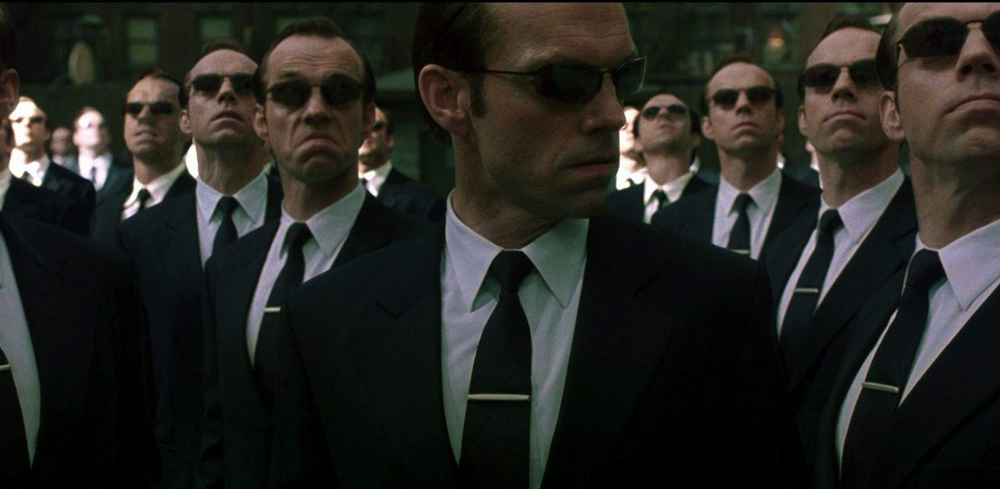

<!-- Hey now, are you reading my source code? -->
<style>
.forceBreak { -webkit-column-break-after: always; break-after: column; }
</style>

```{r setup, include=FALSE}
library(knitr)
opts_chunk$set(echo = FALSE)
```

## The relevant xkcd comic    

<div class="columns-2">


"_If that doesn't fix it, git.txt contains the phone number of a friend of mine who understands git. Just wait through a few minutes of 'It's really pretty simple, just think of branches as...' and eventually you'll learn the commands that will fix everything._"

</div>

## Quick note on jargon

Technobabble is the name of the game here, but here's a rough guide to interpret Git-speak:

> - Git : "The free computer program you're about to learn about"
> - GitHub/GitLab : "Two websites (remotes) where you can store repositories"
> - Repo : "short for repository, a folder that is tracked with version control"
> - Remote : "A (remote) server that houses a copy of your repo"
> - Commit : "Read: take a snapshot in time, or record present state"
> - Branch / Fork : "Read: creating a parallel universe"

## Agenda  

0. What is version control?
1. Using Git locally (a crash-course in Git)
2. Using Git with all your friends (remotes and how to talk to them)

# Part 0. What is version control | and what is "Git"

## How many of you know the pain?  

```{r version-pic, out.width = "500px"}
# TODO: New picture
include_graphics("../img/insanity.png")
```

_Is this version control?_

_Is this **good** version control?_  

## Motivating problems  

__Why are ad-hoc approaches _often_ insufficient?__

- Lack of standards leave collaborators confused  
- When things go bad, they get _really_ bad  
- Project "state" is ambiguous

```{r this_is_fine, out.width = "550px"}
include_graphics("../img/fine.png")
```

## So what is Git?

"[git] is a stupid (but extremely fast) directory content manager.  It
doesn't do a whole lot, but what it _does_ do is track directory
contents efficiently. " - Linus Torvalds  

- Conceived by Linus Torvalds in 2005 (the "Linux guy")  

<div class="columns-2">
```{r git-lord-1, out.width="250px"}

```

<p class="forceBreak"></p>

```{r git-logo, out.width="250px"}
include_graphics("../img/dvc.png")
```
</div>

<div class="notes">
Read Torvalds own description of it here: https://github.com/git/git/blob/e83c5163316f89bfbde7d9ab23ca2e25604af290/README
</div>

## Okay, but what _is_ it  

Git is a tool for tracking the state of your project

- Maintain a detailed revision history
- View tracked files at any prior state  
- Create separate "parallel universes" seamlessly  
- Merge changes in a sensible and predictable way 

<div class="centered">

```{r snapshot, out.width = "400px"}

```

</div>

# How to Git it  

## Gitting set up | Git for Windows  

- __Required regardless of what interface you use__
- Command line daunting for the casual user
- Default commit message editor is Vim (which is _really_ daunting to the casual user)

<div class="columns-2">

```{r git-native-1, out.width = "300px"}
include_graphics("../img/git_cli.png")
```
<p class="forceBreak"></p>
```{r git-native-2, out.width = "300px"}
include_graphics("../img/git_for_win.png")
```
</div>

## Gitting set up | Github Desktop

- Serves as a "point-and-click" interface for Git operations
- Easily manage a large number of repositories from one app  
- _I will be using Github Desktop to demonstrate a GUI interface_  

<div class="centering">

```{r gh_desktop, out.width = "500px"}
include_graphics("https://cloud.githubusercontent.com/assets/359239/26094502/a1f56d02-3a5d-11e7-8799-23c7ba5e5106.png")
```

</div>

# Part 1. Local Git commands | Let's git going  

## Local Git commands  

Primary objectives:  

- Start a new repository
- Create and add files to it
- Create and merge branches
- Checkout previous revisions / other branches

```{r file-stages-1, out.width = "500px"}
include_graphics("https://git-scm.com/book/en/v2/images/lifecycle.png")
```

## Local Git commands 

I'll present each Git operation with it's command line name.

Focus on the association of the name to its respective operation, but don't worry about memorizing them!  

_(We will not be using command line here)_

```{r hackerman, out.width = "400px"}
include_graphics("../img/hackerman.png")
```

<div class="notes">
It's a difficult thing, isn't it? The task is to teach Git without really going to the command line at all.

I'd like to start by building familiarity with the concepts. From there, hopefully it becomes a bit easier to talk about things.
</div>

## Dataflow visualized

```{r git-transport-2, out.width = "500px"}
include_graphics("../img/git-transport.png")
```

credit [Oliver Steele](https://blog.osteele.com/2008/05/my-git-workflow/)

## Create a repository | git init

- `git init` creates an empty repository to begin tracking your files  
- Ideally you would create a repository at the start, but you can do so at any time  
- Not every file present in your project folder has to be tracked in the repo  

```{r init, out.width = "500px"}

```

## View file status | git status

`git status` displays the current state of files in your project

<div class="columns-2">
With Git there are four "states" that your files can reside in:  

- Untracked  
- Unmodified  
- Modified
- Staged  

```{r file-stages, out.width = "450px"}
include_graphics("../img/file_status.png")
```

</div>

## Tracking your files | git add

To add a file to your repository, we use the `git add` command.

- We can also use this command to stage changes of modified files
- Files added are "staged", but we haven't fully "saved" or "committed"

```{r git-add, out.width = "450px"}
include_graphics("../img/add_before.png")
```
```{r git-add-2, out.width = "500px"}
include_graphics("../img/add_after.png")
```

## Recording your changes | git commit

`git commit` creates a record of all tracked files that you've staged.

Produces a message with three core parts:

- Commit message (_"Made implicitly missing data explicit"_)
- Commit author (me)  
- SHA1 hash (unique to every commit, used to reference)

```{r commit, out.width = "500px"}
include_graphics("../img/commit.png")
```

## Removing a file from the repo | git rm

`git rm` removes a file both from disk and from the repo

- Base operation the same as deleting file and then staging the changes  
- Removes the files from the current index (and all future commits)

## Be mindful of what you track!  

```{r deploy_key, out.width = "800px"}

```

## Be mindful of what you track!  

With very few exceptions, everything tracked within Git can be recovered.  

- In a "parallel universe", you never deleted that data file  
- Begin thinking about this *before* you make a commit
- Be especially careful of PII, passwords, private keys, etc.

## "ignoring" files | or: practicing mindfulness  

With a `.gitignore` file in your repo, you can specify explicitly what files or folders you want to remain un-tracked.  

- This is simply a file in your root folder
- [Templates](https://github.com/github/gitignore) are available online for many languages and project types

```{r ignore, out.width = "500px"}
include_graphics("../img/ignore.png")
```

# Seeing it in action

## Demonstration  

Let's see how all of these commands work for a simple task:  

- Initialize a new repository in GitHub Desktop 
- Create and commit a simple script from RStudio  
- Create an commit a `.gitignore` file  
- Remove an unwanted file from the repository  

<div class="notes">
Here we will create a new repository
</div>


## Enter: Branching

Changes don't have to be linear!

A branch allows you to diverge from the main track while keeping the state of the main track intact.  

- A branch inherits its history from its parent
- Easily merge back in changes you made in the branch (even if the parent continues to develop independently)  

<div class="centering">

```{r branching, out.width = "475px"}
include_graphics("../img/branch.png")
```

</div>

## Creating a branch | git branch

`git branch` creates a new branch off of the current one

- If you're just starting out, the current branch is likely *master* or *main*    
- [Visualize](http://git-school.github.io/visualizing-git/) it yourself

```{r branches, out.width = "400px"}

```


## Switching branches | git checkout  

`git checkout` is used to switch between branches and a few more things:  

- The same function is used to "checkout" a previous commit  
- Also used to "un-modify" a file (ie. modified -> unmodified)
    - `git checkout -- <file>`
    - **This effectively erases any unstaged progress!**  

## Merging branches | git merge  

`git merge` is used to merge a distant branch into the current one.

- Merging does not automatically delete the branch being merged in  
    - The history of the distant branch is also added to the current branch  
- Most of the merges locally will be "fast-forward" merges

# Let's take a look

## Working with branches  

Looking back at the same repo we created earlier, let's try out these new commands:  

- Create a new branch and check it out
- Make changes in our new branch and merge them into master  
- Checkout a past commit  

<div class="notes">
If you're following along with no git installation, you might try the GitHub  
visualization tool to test these concepts: http://git-school.github.io/visualizing-git/  
</div>

## Where merges git dicey  

If you (or your team) develops on more than one branch concurrently, you may run into merge conflicts.  

- If the same line is edited across branches, Git will not know what one takes precedence in a merge
- Several merge [strategies](https://git-scm.com/docs/git-merge#_merge_strategies) exist to automate this  
- For small merges it's often easier to workup manually  

```{r conflit, out.width = "500px"}
include_graphics("../img/conflict.png")
```

## Fixing a merge conflict

Git will provide indicators in any files containing merge conflicts indicating what lines deviate  

```
<<<<<<< <current_branch>
I'm not a cat
=======
I'm not a lawyer
>>>>>>> <branch_being_merged>
```

- Fix the document as you want it to appear and stage the changes
- Sometimes it's not an A/B problem and will require revision  

Let's demonstrate...  

# Part 2. Using Git with all your friends  

# Almost there!

## Starting a new project on GitLab

When using GitLab or GitHub, you can start your repository directly from the website  

- You can also create a blank repository and push a repo you've already created locally  
- Projects can be housed under either a user or group namespace  
- Optionally set visibility (just _how_ collaborative do you want to be?)

__Let's take a look...__  

## Interacting with remotes

Now that we have a _remote_ repository set up, we need to introduce just three more git commands to interact with that repository:

- git clone  
- git pull
- git push

<div class="notes">

If you're reading this it's because you saw that I'm skipping fetch and died a little inside.

I think fundamentally fetch is the safer and better option for most projects, but for small scale projects most will likely not notice the difference (especially if they're working alone).

Those that do notice will discover the difference eventually, and it avoids having to teach it here in such a short time slot.

For the astute among you who read this:

git fetch pulls refs and objects from the remote, but does not merge them in.
git pull performs a fetch and then attempts to merge them

</div>

## Recall our Dataflow

```{r git-transport, out.width = "500px"}
include_graphics("../img/git-transport.png")
```

credit [Oliver Steele](https://blog.osteele.com/2008/05/my-git-workflow/)

## Cloning an existing repository | git clone  

`git clone` creates a local copy of a remote repository  

- You Only Clone Once (YOCO)
- By default, the directory will be named after the title of the repository  
- **It is not possible to "clone" bits and pieces of a larger repository**   

```{r clones, out.width = "450px"}

```

## Gitting changes from remote | git pull  

`git pull` returns any updates from a remote repository and merges them locally  

- Notice that I said it merges those changes (be wary)  
- `fetch` is safer because it does not attempt to merge automatically  
- When in doubt, just look at the changes online  

## Pushing your changes | git push  

Finally, we send our updates to the remote repository using `git push`

- Double check that everything is in order _before_ you push  
- It's best practice to always `pull` before `commit` and `push`

```{r push, out.width = "450px"}
include_graphics("../img/push.jpg")
```

# Demonstration

# Takeaways

## Takeaways

There are many workable models for how best to use these commands

```{r, out.width = "500px"}
include_graphics("https://i2.wp.com/lanziani.com/slides/gitflow/images/gitflow_1.png")
```

## Takeaways

My advice:  

<div class="columns-2">

- Commit often, grouping changes logically  
- Branch earlier rather than later  
- Make your commit messages *descriptive*

<p class="forceBreak"></p>

```{r messages, out.width = "250px"}
include_graphics("../img/messages.jpg")
```

</div>

## There's a lot more here to talk about  

Stashing, blaming, diffing, cherry-picking, rebasing

We will stop here for the sake of time and to avoid overload

```{r stop, out.width = "500px"}

```

## Getting help

I hope you'll continue to explore!

- These slides (and the Rmd source) are available on [GitHub](https://github.com/beansrowning/git-talk)  
- Ready for a deeper dive? Check out the [book](https://git-scm.com/book/en/v2)

```{r help, out.width = "500px"}

```

# Thanks!